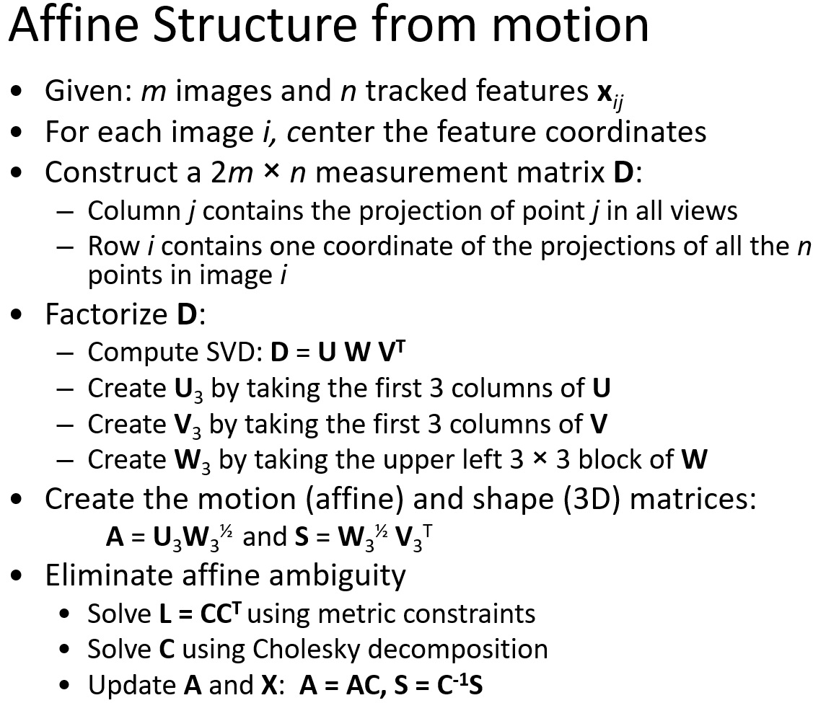
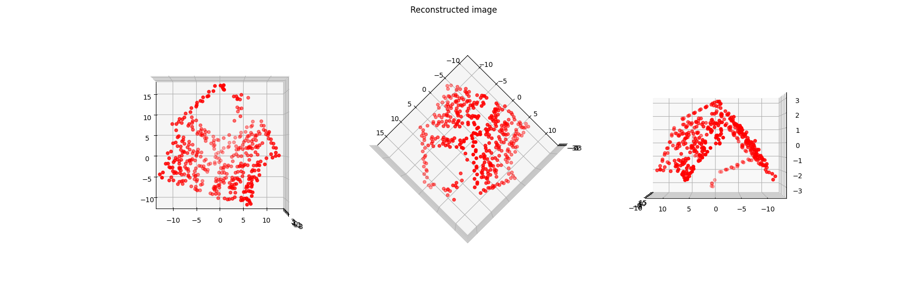
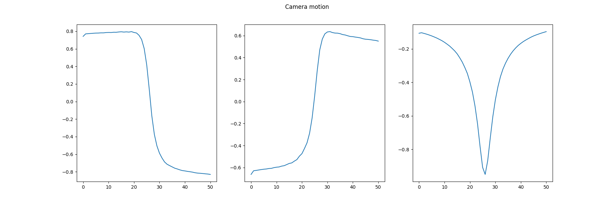

# Affine Structure from Motion
### This is the implementation of  "Shape and Motion from Image Streams under Orthography: a Factorization Method" by Tomasi and Kanade from scratch

* To construct the shape and motion, the porgram is given an input of image sequence of 50.
* The image sequence consists of features tracked using Lucas - Kanade Optical Flow Algorithm.
* Once all the tracks are computed, a Measurement matrix is constructed with the size of (2mxn) where m is the number of images and n is the number keypoints detected per image.
* Then the motion matrix is further decomposed and factorized and obtained Motion and structure matrix where the affine ambiguity is further eliminated by cholesky decomposition.

### Structure from motion algorithm
Algorithm          | 
:-------------------------:|
 |

### Keypoints and their Trajectory
Feature Points             |Tracks
:-------------------------:|:-------------------------:
  |  

### Structure Obtained
Structure            | 
:-------------------------:|
 |

### Motion of Cameras
Camera motion         | 
:-------------------------:|
 |

